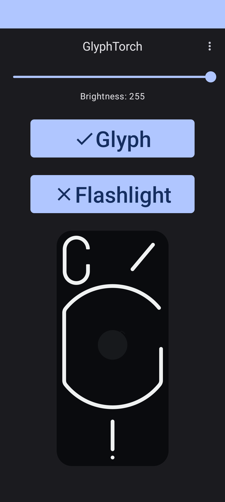
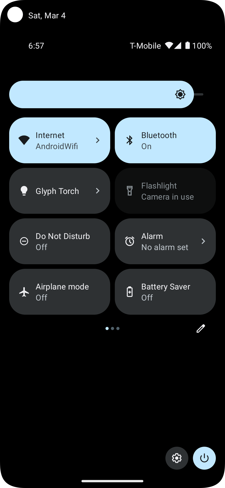
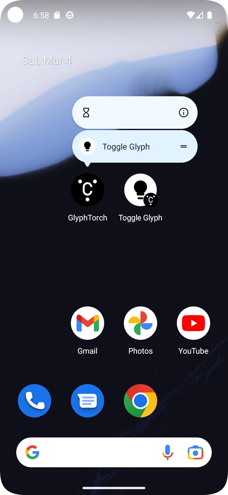

# GlyphTorch
This is a very simple app allowing to use the Glyph interface as torch for Nothing Phone (1).

Also provide quicksetting tile and shortcut to toggle the torch.

## Important Note: Requires Root
This app relies on read and write to sysfs to work, so root permission is required. Unless official support to access the glyph interface is added, there's no other way. (except for the janky builtin led tester app)

As this is in very early stage, expect there to be crashes and bugs.

    
    
    

